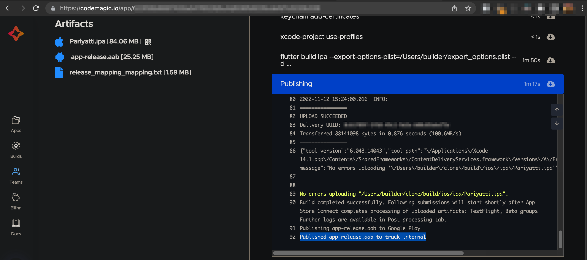
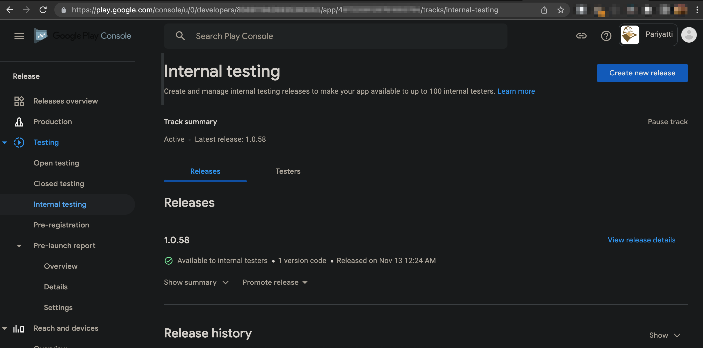
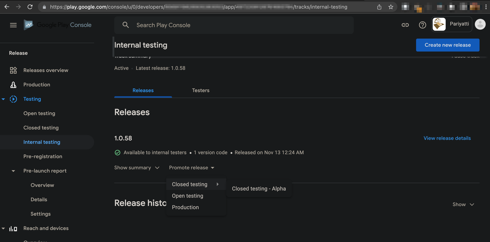
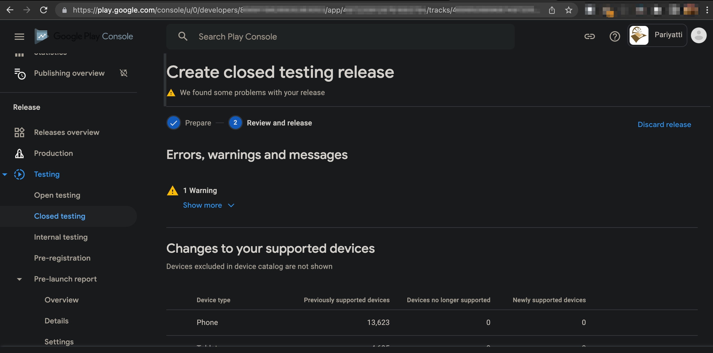
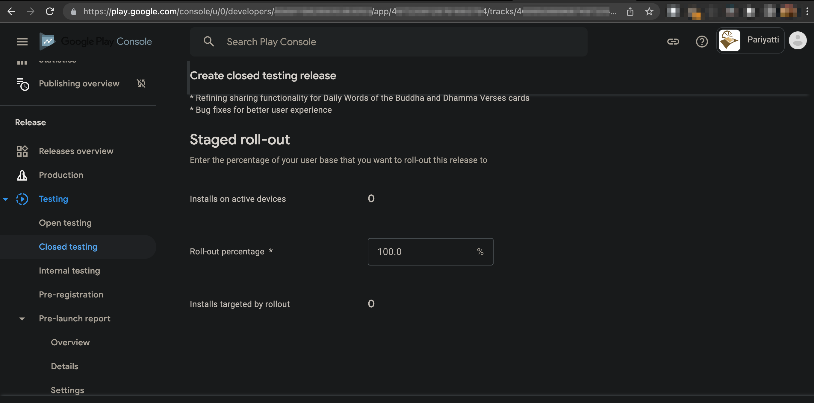
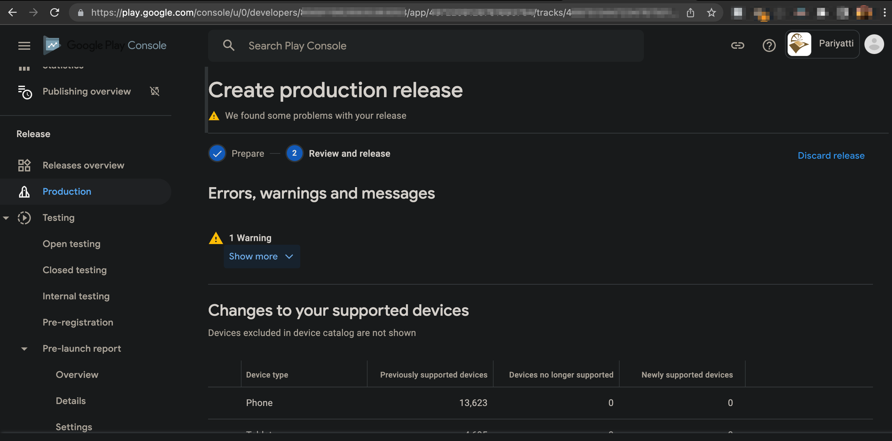
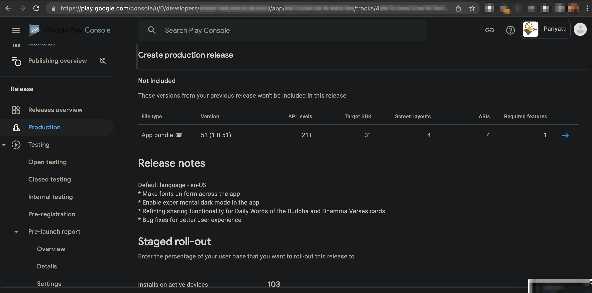
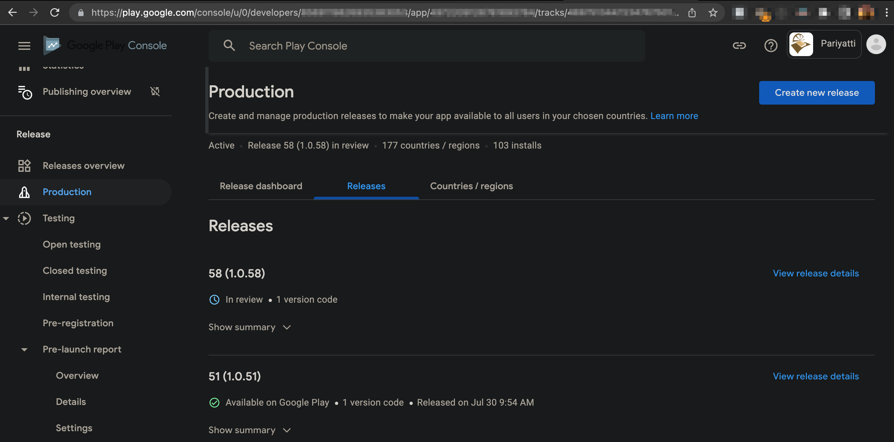
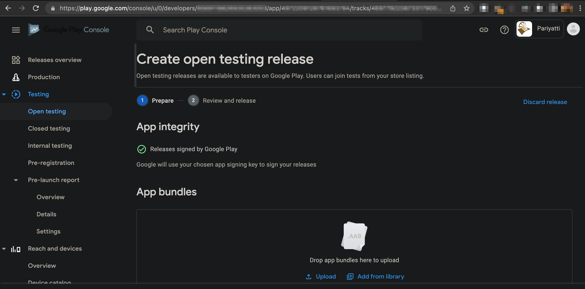
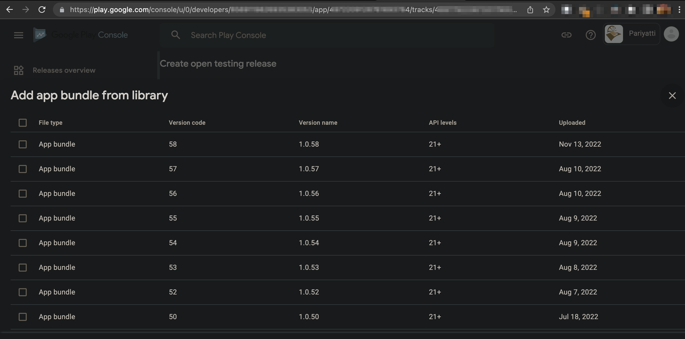

# Releasing the Pariyatti Mobile App

Submission of apps to the android and iOS app stores happens during the CI builds on master branch. It is handled by codemagic pipeline and is part of codemagic.yaml configuration.

By default the submission is for internal dev testing equivalent for both the stores. This means only the users who are part of the internal dev testers shall get the testflight update or internal testing build from the Google play store. Reach out to the [Project Manager/Site Reliability Engineer](https://pariyatti.app/contributors.html) with the details of which Apple AppStore/Google Play email address you would like to get added to the list.

## Android

### Overview

The Google Play Console offers four tracks for release management:

1. Internal Testing
1. Closed Testing
1. Open Testing
1. Production

For the Pariyatti Mobile app at this point we do not need four different channels. While we are currently updating apps in all the four channels, we shall formalize the workflow for fewer tracks to maintain.

A simple workflow would be Internal Testing --> Open Testing --> Production

Here, "Open Testing" refers to "public beta" channel. Public Beta channel in Play Store is currently open for anyone to join and does not need any approvals. This can help in getting early feedback for potential issues from anyone who volunteers to join the beta track.

### Android App release steps

1. Login to the CodeMagic console and check that for the targest app version containing the commits that you would like to promote, app-release.aab has been submitted to internal track.

1. Head over to the Google Play console and confirm that the release is already present in internal testing

1. Promote the target release to closed testing

1. Review the release for any errors and review warnings

1. We are currently rolling out 100% at release at this point for all stages

1. Promote to create production release similar to closed testing release

1. Confirm that the release notes are appropriate and submit for review. It can take anywhere from a few hours to 1-2 days for getting the approval from Play Store and the app being published

1. You can check the status of your submission in the Production menu tab

1. For consistency, create an open testing release as well.

1. Select the correct version and review and submit it like in previous releases

## iOS

TODO
