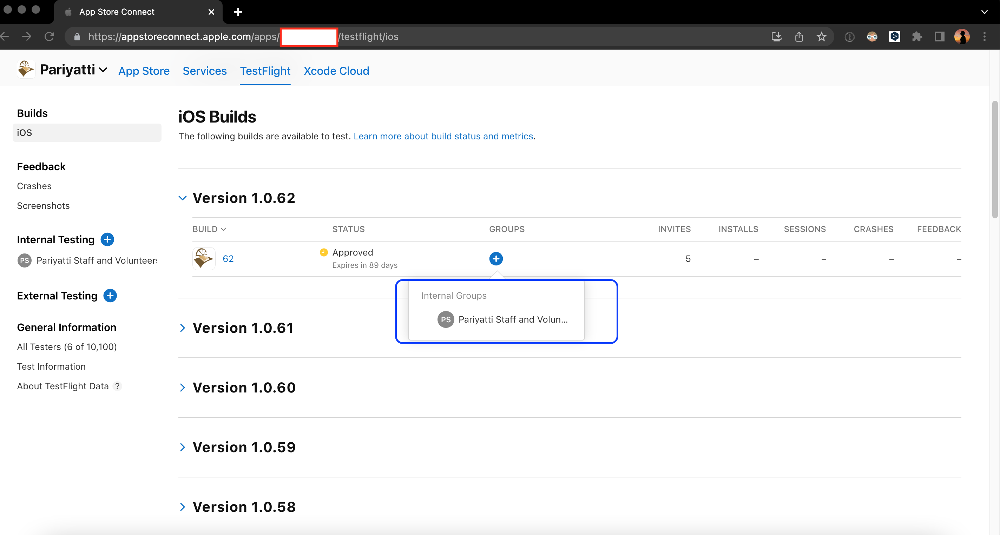
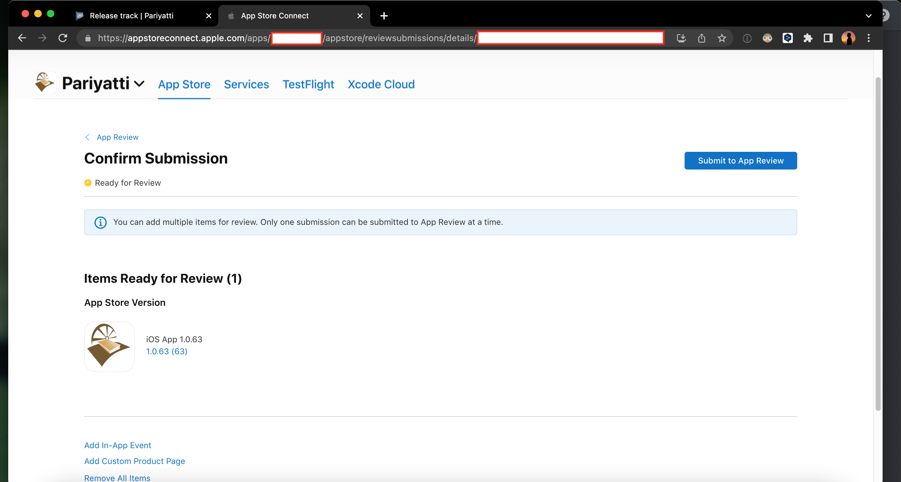

# Releasing the Pariyatti Mobile App

Submission of apps to the android and iOS app stores happens during the CI builds on master branch. It is handled by codemagic pipeline and is part of codemagic.yaml configuration.

By default the submission is for internal dev testing equivalent for both the stores. This means only the users who are part of the internal dev testers shall get the testflight update(once it is added) or internal testing build from the Google play store. Reach out to the [Project Manager/Site Reliability Engineer](https://pariyatti.app/contributors.html) with the details of which Apple AppStore/Google Play email address you would like to get added to the list.

## Android

### Android Overview

The Google Play Console offers four tracks for release management:

1. Internal Testing
1. Closed Testing
1. Open Testing
1. Production

For the Pariyatti Mobile app at this point we do not need four different channels. While we are currently updating apps in all the four channels, we shall formalize the workflow for fewer tracks to maintain.

A simple workflow would be Internal Testing --> Open Testing --> Production

Here, "Open Testing" refers to "public beta" channel. Public Beta channel in Play Store is currently open for anyone to join and does not need any approvals. This can help in getting early feedback for potential issues from anyone who volunteers to join the beta track.

### Android App release steps

1. Login to the CodeMagic console and check that for the targest app version containing the commits that you would like to promote, app-release.aab has been submitted to internal track.

1. Head over to the Google Play console and confirm that the release is already present in internal testing

1. Promote the target release to closed testing

1. Review the release for any errors and review warnings

1. We are currently rolling out 100% at release at this point for all stages

1. Promote to create production release similar to closed testing release

1. Confirm that the release notes are appropriate and submit for review. It can take anywhere from a few hours to 1-2 days for getting the approval from Play Store and the app being published

1. You can check the status of your submission in the Production menu tab

1. For consistency, create an open testing release as well.

1. Select the correct version and review and submit it like in previous releases

## iOS

In iOS App Store Connect we have fewer tracks to manage. There are two at this point:

### iOS Overview

1. TestFlight
1. Production Release

TestFlight requires special user invitation and the invited users need to install the TestFlight app on their iOS devices to get the version in TestFlight.

### iOS App release steps

1. Login to Apple Developer Console, and launch App Store Connnect.

1. TestFlight Release: Select the target version that is slated for a release and associate it with the internal group "Pariyatti Staff and Volunteers". Based on the changes, inform the internal communication thread that build is available to test.

1. In case there is a need to modify the Group member list, head to the group in "Internal Testing". This shows the list of current members and the versions their TestFlight apps are running.

1. Production Release: Head to "App Store" tab in App Store Connect and click on the +(plus) icon besides the iOS app and enter the target semver of the app that was generated by CI as seen previously

1. Add the release notes, these would highly be probably same accross both Android and iOS apps, unless we are addressing a platform specific issue.

1. Select the target version in the "Build Section"

1. Select automatic release and release to all the users. We are defaulting to the simplest release process.

1. Check the release information once and add it to queue using "Add for Review" button

1. Confirm submission and "Submit to App Review"

Both the app release processes take a few hours typically to be approved and emails are sent to us once the app has been made live. So, watch out for those. Thank you!
